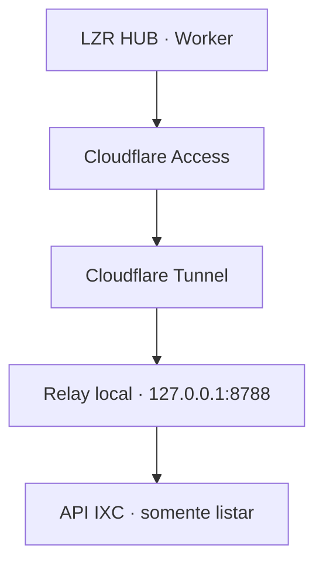

# Relay IXC com egress fixo

## Problema

O LZR HUB executa em Cloudflare Workers, cujo IP de saída padrão não é estável. O IXC exige allowlist de origem. Permitir faixas amplas ou colocar o token IXC no Worker reduziria a segurança. A solução é um relay dedicado da BBNET, com egress planejado em `168.181.31.250`.

O IP informado é um requisito de infraestrutura, não uma evidência. Nesta entrega sua posse, estabilidade, NAT e rota ainda estão **BLOQUEADOS POR INFRAESTRUTURA**.

## Fluxo

O IXC deve enxergar `168.181.31.250` como origem. O relay é o único componente que guarda `IXC_API_TOKEN` em produção.

## Responsabilidades

| Componente | Responsabilidade |
| --- | --- |
| Worker | regras do Customer 360, allowlist, cache, telemetria, circuit breaker e chamada assinada |
| Cloudflare Access | validar Service Token exclusivo do LZR HUB |
| Cloudflare Tunnel | entrada autenticada sem publicar a porta da aplicação |
| Relay | validar Access/HMAC/replay, operação e cliente; impor limites; mapear operação para IXC |
| IXC | responder às consultas read-only vindas do IP permitido |

O Worker não repete timeout do relay. O relay admite no máximo um retry de timeout, HTTP 429 ou 5xx. Assim, uma operação produz no máximo duas chamadas ao IXC.

## Contrato fechado

O relay aceita apenas:

- `testConnection`
- `getCustomer`
- `listContracts`
- `getPlan`
- `listInvoices`
- `listPayments`
- `listServiceOrders`
- `getConnection`

O cliente envia somente `operation` e `parameters` validados. URL, hostname, resource, path, método, headers, token, `qtype`, `oper`, ordenação e corpo IXC são definidos no relay. Campos extras são recusados. Redirects são bloqueados.

Somente `POST` com `ixcsoft: listar` é emitido para:

| Operação | Recurso IXC | Filtro controlado |
| --- | --- | --- |
| `testConnection` | `cliente` | `id = 0` |
| `getCustomer` | `cliente` | `id = customerId` |
| `listContracts` | `cliente_contrato` | `id_cliente = customerId` |
| `getPlan` | `vd_contratos` | `id = planId` |
| `listInvoices` | `fn_areceber` | `id_cliente = customerId` |
| `listPayments` | `fn_movim_finan` | `id_cliente = customerId` |
| `listServiceOrders` | `su_oss_chamado` | `id_cliente = customerId` |
| `getConnection` | `radusuarios` | `id_cliente = customerId` |

A Collection Postman da Issue #23 ainda não existe na `main`; portanto, o mapeamento foi confirmado no provider e nos testes atuais, e a validação cruzada com Postman permanece pendente sem sobrescrever aquele trabalho.

## Defesa em camadas

1. Cloudflare Access exige Service Token.
2. O relay exige presença dos headers Access.
3. HMAC SHA-256 assina versão, timestamp, nonce, método, pathname, hash do corpo e correlation ID.
4. Comparação em tempo constante.
5. Janela de relógio de 60 segundos.
6. Nonce consumido uma única vez e retido por 120 segundos.
7. Allowlist de clientes validada antes da rede.
8. Rate limit, concorrência, timeout e circuit breaker.
9. Bind exclusivo em loopback e firewall.
10. Container não root, somente leitura, sem capabilities e sem Docker socket.

O relay confia no Cloudflare Access para validar o Service Token na borda; a presença dos headers na origem não substitui essa política. O HMAC protege integridade e autentica o Worker também no relay.

## Modelo de ameaça

| Ameaça | Controle |
| --- | --- |
| Proxy aberto/SSRF | catálogo fixo; sem URL/path/resource arbitrário |
| Reuso de chamada | timestamp curto + nonce |
| Alteração do corpo | hash do corpo dentro do HMAC |
| Roubo do token IXC no Worker | token existe somente no relay |
| Escrita acidental | catálogo somente leitura + duas flags obrigatoriamente falsas |
| Tempestade de retries | orçamento total de duas tentativas no relay e zero no Worker |
| Vazamento em logs | eventos estruturados e sanitizados; sem payload bruto |
| Bypass do Tunnel | porta presa a `127.0.0.1` e firewall |

## Falha segura

Em produção, `IXC_TRANSPORT=relay`. `IXC_TRANSPORT=direct` é recusado pela configuração. Se Access, HMAC, Tunnel, relay ou IXC falharem, a consulta retorna erro controlado e o atendimento entra em modo degradado. Não existe fallback `relay → direct`.

`IXC_WRITE_ENABLED` e `FEATURE_IXC_WRITE` devem permanecer `false`. O relay se recusa a iniciar se qualquer uma for `true`.

## Secrets

| Secret | Local |
| --- | --- |
| `CF_ACCESS_CLIENT_ID` | secrets do Worker |
| `CF_ACCESS_CLIENT_SECRET` | secrets do Worker |
| `IXC_RELAY_HMAC_SECRET` | secrets do Worker e `/etc/lzr/ixc-relay.env` |
| `IXC_API_TOKEN` | somente `/etc/lzr/ixc-relay.env` |
| Tunnel token | `/etc/lzr/secrets/cloudflared-token` |

Cada secret tem finalidade e rotação próprias. Nenhum usa prefixo `NEXT_PUBLIC`.

## Observabilidade

Logs: timestamp, correlation ID, operação, status, duração, tentativa, contagem de registros, código sanitizado, ambiente e versão. Não registram request/response bruto, PII, Authorization, Access, assinatura ou secrets.

Contadores em memória:

- `relay_requests_total`
- `relay_success_total`
- `relay_errors_total`
- `relay_auth_failures_total`
- `relay_replay_blocked_total`
- `relay_ixc_timeout_total`
- `relay_ixc_ip_not_allowed_total`
- `relay_latency_ms`
- `relay_circuit_breaker_state`

Falha de observabilidade nunca bloqueia o atendimento.

## Alta disponibilidade e riscos residuais

A versão inicial usa um relay e um IP, criando ponto único de falha. O contrato `IxcTransport` permite adicionar um segundo destino no futuro, mas nenhum failover foi ativado sem infraestrutura. O failover futuro deve manter allowlist, HMAC, secrets independentes e jamais cair para acesso direto.

Riscos residuais:

- indisponibilidade do único servidor/rota/IP;
- erro de relógio acima da tolerância;
- dependência de Access/Tunnel;
- necessidade de confirmar os mapeamentos com a Collection Postman;
- métricas atualmente locais ao processo;
- egress e allowlist real ainda não comprovados.
